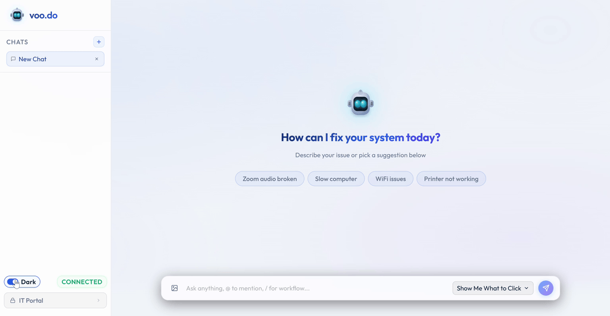

# Voodo — AI Tech Support Agent

> **Winner — [HackAgents BIU 2026](https://ofirlin.github.io/hackagents-biu/)** — the 24-hour agentic-AI hackathon hosted by Bar-Ilan University, May 14–15, 2026.

## Team

| Member | LinkedIn |
|---|---|
| Yarden Carmi | [linkedin.com/in/yarden-carmi](https://www.linkedin.com/in/yarden-carmi) |
| Tal Segal | [linkedin.com/in/tal-segal-a405992a6](https://www.linkedin.com/in/tal-segal-a405992a6/) |
| Lee Seznayof | [linkedin.com/in/lee-seznayof](https://www.linkedin.com/in/lee-seznayof/) |
| Liav Samiya | [linkedin.com/in/liav-samiya-76b6b327a](https://www.linkedin.com/in/liav-samiya-76b6b327a/) |

---

**Voodo** is an autonomous AI agent that fixes Windows tech issues by seeing your screen, reasoning about what's wrong, and acting with mouse and keyboard — just like a remote support technician, but instant, available 24/7, and with an enterprise-grade security model.

You describe the problem in a chat UI. The agent takes a screenshot, reasons over it with a vision-language model, and dispatches precise GUI actions to resolve the issue. Repeat problems are answered in seconds from a shared, semantically-searchable solutions database.

---

## Why Voodo

| Problem | How Voodo Solves It |
|---|---|
| Tech support queues take hours | Agent acts autonomously in real time — no waiting |
| Repeat issues waste support time | Vector DB caches solutions; known fixes reuse instantly |
| Remote tools need open firewall ports | Executor dials out; zero inbound port exposure |
| Screen-sharing leaks sensitive data | Audit log redacts passwords; IT approves all stored fixes |
| Runaway automation is dangerous | Per-session caps, dangerous-key blocklist, failsafe panic button |
| One-size-fits-all automation doesn't teach | Guide Mode teaches users where to click instead of doing it for them |

---

## Key Features

### Autonomous Computer Use
The agent operates a full GUI automation loop: screenshot → reason → act → screenshot. Every action is grounded in a live screenshot so the agent never assumes the screen state — it sees what's actually there before each click or keystroke.


### Two Operating Modes
- **Control Mode** — The agent fully resolves the issue on the user's behalf. Keyboard and mouse actions require explicit user approval before execution, shown as an in-chat permission dialog.

  

- **Guide Mode** — The agent annotates the screen with spotlight overlays and typing bubbles, teaching the user where to click and what to type. The agent never touches the machine; system-mutation tools are disabled.

  

### Shared Solutions Knowledge Base
A self-hosted Postgres + pgvector database stores every solved problem as a 384-dimensional semantic embedding. When a new issue comes in, the agent searches for similar past fixes and injects safe hints into its initial prompt — turning hours into seconds for repeat issues.

An IT approval workflow gates what goes into the shared database: the agent writes fixes to a `pending_changes` table; IT staff review and approve via a protected dashboard before solutions are promoted.


### Real-Time Streaming UI
- LLM reasoning streams word-by-word to the chat UI (visible typing effect)
- Each tool call and its result appears as a live step in the conversation
- Users can **pause**, **resume**, or **cancel** a run mid-flight
- A floating desktop widget mirrors the agent's progress and surfaces permission prompts




### Enterprise Security Model
Security is not an afterthought — it is designed into every layer:

- **Hard tool allow-list**: Only explicitly permitted tools can be called. Deny-by-default.
- **Prompt injection defense**: Unicode normalization, invisible character stripping, and aggressive regex catch injection attempts in user messages and screen text.
- **Rolling keystroke inspection**: Detects shell commands split across multiple `type()` calls.
- **Dangerous key blocklist**: Win+R, Win+X, Ctrl+Alt+Delete, and similar hotkeys are rejected outright.
- **Per-session caps**: Maximum 500 characters typed and 5 destructive actions per session, enforced with thread-safe counters.
- **Audit logging**: Every action is written to a tamper-evident JSON log; control characters are scrubbed to prevent line-injection attacks.
- **Secret redaction**: Stored solutions scrub `type()` arguments to `<redacted>` so passwords and search queries are never persisted.
- **Path allowlist**: File read/search tools are restricted to user home, Desktop, Documents, and Downloads; system directories are blocked.
- **Failsafe panic button**: Mouse-to-corner triggers pyautogui's built-in failsafe, giving users a physical kill switch.

### Firewalled-Friendly Architecture
The Windows executor is a thin client that dials out to the backend over WebSocket — the backend never connects inward. Users behind NAT or corporate firewalls need zero port-forwarding or VPN configuration.

### LLM-Agnostic Backend
Models are served via [OpenRouter](https://openrouter.ai) — any vision-capable, tool-calling model on the gateway works. The default is `qwen/qwen3-vl-235b-a22b-thinking`. Switch by setting `LLM_MODEL` in `.env`.

---

## Architecture

```
┌─ Backend (Docker host) ─────────────────┐     ┌─ Windows user box ───────┐
│                                         │     │                          │
│  backend (FastAPI + agent loop)         │     │  voodo executor          │
│      :7860 — /         chat UI          │ ◀───WS── (dials out)           │
│            — /executor  reverse-WS      │     │        │ pyautogui /     │
│        │                                │     │        │ mss / pwsh      │
│        ▼                                │     │        ▼                 │
│  Postgres + pgvector (Docker)           │     │   user's screen          │
│      :5432                              │     │                          │
└────────┬────────────────────────────────┘     └──────────────────────────┘
         │                                              ▲
         ▼                                              │
   OpenRouter (hosted LLM)                              │ (chat UI in any browser)
   https://openrouter.ai/api/v1                         │
                                                http://<backend-host>:7860
```

The Windows executor is a ~300-line service that handles screenshots, mouse/keyboard, and system diagnostics. The backend orchestrates the agent loop and proxies model calls to OpenRouter. The user opens the chat UI in any browser.

---

## Repo Layout

| Path | Runs on | Purpose |
|---|---|---|
| [`shared/`](shared/) | both | Wire types, security, config. Source of truth for allowed tools. |
| [`server/`](server/) | backend host (Docker) | Agent loop, FastAPI app, DB client, compose files |
| [`server/agent/`](server/agent/) | backend | Multi-turn computer-use loop |
| [`server/app/`](server/app/) | backend | FastAPI server + chat UI + IT dashboard |
| [`server/db/`](server/db/) | backend | Postgres + pgvector + seed data + approval workflow |
| [`server/docker/`](server/docker/) | backend | Dockerfile for the backend image (compose lives at repo root) |
| [`docker-compose.yml`](docker-compose.yml) | backend | Postgres + backend compose stack |
| [`server/scripts/`](server/scripts/) | backend | `dev_all.sh`, `stop_all.sh` |
| [`client/`](client/) | Windows | Everything that runs on the user's machine |
| [`client/executor/`](client/executor/) | Windows | Thin WebSocket client: screenshot, click, type, system tools |
| [`client/scripts/`](client/scripts/) | Windows | `dev_all.ps1`, the floating widget, the spotlight overlay |

---

## Quickstart

### 0. Get an OpenRouter API key

Sign up at [openrouter.ai](https://openrouter.ai), create a key at [openrouter.ai/keys](https://openrouter.ai/keys), copy it.

### 1. Configure `.env`

```bash
cp .env.example .env
# Edit .env: paste OPENROUTER_API_KEY, generate EXECUTOR_TOKEN, set passwords.
# EXECUTOR_TOKEN can be generated with:
#   python -c "import secrets; print(secrets.token_hex(24))"
```

### 2. Backend (Docker)

```bash
bash server/scripts/dev_all.sh
# Brings up Postgres + the backend in compose. Seeds 40 canned Windows fixes
# on first run. Logs:
#   docker compose logs -f backend
```

### 3. Windows machine (the one being fixed)

```powershell
.\client\scripts\dev_all.ps1 -Backend "ws://<backend-host>:7860"
# Token defaults to EXECUTOR_TOKEN from the repo-root .env.
# The executor dials out — no inbound ports required.
```

### 4. Chat UI

Navigate to `http://<backend-host>:7860` in any browser. Describe your problem. The agent takes it from there.

---

## Development Flags

| Flag | Effect |
|---|---|
| `MOCK_AGENT=1` | Returns canned events — pure UI development, no agent needed |
| `MOCK_LLM=1` | Real agent loop with canned LLM responses — needs executor but not OpenRouter |
| `SKIP_DB=1` | Skips Postgres — useful if the DB container is not running |

---

## IT Dashboard

Staff with IT credentials can access `http://<backend-host>:7860/it` to:
- Review all stored solutions
- Approve or reject pending fixes before they enter the shared knowledge base
- Add reviewer notes

Credentials are configured via `IT_USERNAME` / `IT_PASSWORD` in `.env`. Default credentials are rejected in production mode (`VOODO_PROD=1`).

---

## Seeded Solution Library

The database ships with 40 common Windows fixes ready on day one, covering categories such as:

- Connectivity — Wi-Fi, Bluetooth, DNS, external display
- Audio & video — wrong output device, camera not working
- Performance — disk space, slow boot, frozen apps
- Peripherals — printers, USB devices, keyboard issues
- Settings — default browser, time zone, clipboard
- Updates — Windows Update stuck, driver rollbacks

Novel solutions discovered during live sessions are submitted for IT review and, once approved, instantly available to all users.

---

## Security Notes for Production

Before going to production, set the following in `.env`:

```
VOODO_PROD=1
OPENROUTER_API_KEY=<your key>
EXECUTOR_TOKEN=<16+ character random token>
IT_USERNAME=<non-default value>
IT_PASSWORD=<non-default value>
ADMIN_PASSWORD=<non-default value>
```

The backend validates these requirements at startup and refuses to run with weak defaults when `VOODO_PROD=1`.
